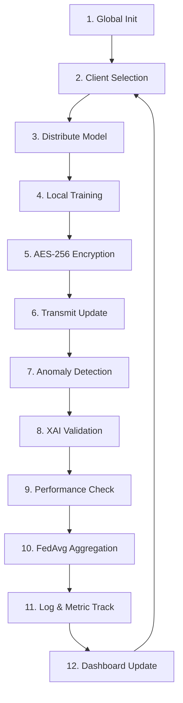

# 🛰️ FedTransformer: Federated Learning for 6G-ISAC


[](https://www.python.org/downloads/)
[](https://pytorch.org/get-started/locally/)
[](https://opensource.org/licenses/MIT)

**FedTransformer** is a high-fidelity research platform designed for **Federated Learning (FL)** applications within **6G Integrated Sensing and Communication (ISAC)** environments. Utilizing a state-of-the-art **Transformer-based backbone**, the system enables private, decentralized signal classification and sensing while maintaining peak network performance through multi-layered security and post-hoc explainability.

---

## 💎 Key Features

- **🧠 Transformer Architecture**: Attention-based sequential processing for high-dimensional 6G signal classification and Doppler shift analysis.
- **🛡️ 3-Tier Security**:
  - **AES-256-GCM**: Military-grade encryption for local update transmissions.
  - **Anomaly Detection**: Cosine Similarity-based filtering to detect and reject poisoned model updates.
  - **Node Quarantine**: Automatic blacklisting of malicious entities to protect the global model's integrity.
- **🔍 XAI-Driven Validation**: Dual-stage verification using SHAP (SHapley Additive exPlanations) to ensure client updates are statistically coherent and honest.
- **🌊 6G-ISAC Simulation**: High-fidelity environmental modeling (CSI, SNR, Doppler Shift, Multi-path Delay, and Radar RCS).
- **🎨 Glass-Tech Dashboard**: A premium, real-time interactive UI powered by FastAPI and WebSockets for monitoring training progress across 12-step communication rounds.

---

## 🏗️ System Architecture

The FedTransformer orchestrates a decentralized 12-step communication loop to ensure secure and efficient global model convergence.



---

## 📡 6G-ISAC Feature Space

The simulation generates synthetic data representing **4 Network States**: 
`Normal`, `High Interference`, `Target Detected`, and `Congestion`.

| Domain | Signal Features |
| :------- | :------- |
| **Channel (CSI)** | Amplitude, Phase, Doppler Shift, Multipath Delay, Angle of Arrival (AoA) |
| **Quality** | RSSI (dBm), Signal-to-Noise Ratio (SNR), Bit Error Rate (BER) |
| **Sensing (Radar)** | Radar Range, Velocity, Radar Cross Section (RCS) |
| **Traffic** | Throughput (Mbps), Jitter, Packet Loss, Active User Density |

---

## 📐 Theoretical Framework

### Federated Averaging (FedAvg)
Model weights $w$ are aggregated from $K$ selected clients based on their local dataset size $n_k$:
$$w_{t+1} = \sum_{k=1}^K \frac{n_k}{N} w_k^t$$

### Multi-Head Attention
The core of our **Transformer** uses Scaled Dot-Product Attention to identify patterns across signal sequences:
$$\text{Attention}(Q, K, V) = \text{softmax}\left(\frac{QK^T}{\sqrt{d_k}}\right)V$$

### Security: Update Similarity
We maintain a similarity threshold $\tau \ge 0.75$ using **Cosine Similarity** to verify update alignment:
$$\text{sim}(w_{global}, w_{local}) = \frac{w_g \cdot w_l}{\|w_g\| \|w_l\|}$$

---

## 🚀 Quick Start

### 1. Installation
Ensure you have Python 3.9+ installed. Clone the repository and install the dependencies:
```bash
git clone https://github.com/FedTransformer/FedTransformer.git
cd FedTransformer
pip install -r requirements.txt
```

### 2. Launch the Research Dashboard (Premium UI)
The project features a full-stack dashboard for real-time monitoring.
```bash
python server.py
```
📍 Visit **[http://localhost:8000](http://localhost:8000)** to view the Glass-Tech interface.

### 3. Run Headless Simulation
Execute the training loop via CLI with configurable hyperparameters:
```bash
python main.py --rounds 20 --clients 50 --clients_per_round 10 --lr 0.001
```

---

## 📂 Project Structure

```bash
FedTransformer/
├── assets/              # README visuals and documentation artifacts
├── config/              # Centralized hyperparameters and CLI parsing
├── federated_learning/  # Core FL logic
│   ├── aggregation/     # FedAvg and advanced weighting algorithms
│   ├── coordinator.py   # 12-step Orchestration & Simulation engine
│   ├── explainability/  # SHAP-based feature importance (XAI)
│   ├── models/          # Transformer architecture and update validator
│   └── security/        # AES-256-GCM encryption and Anomaly Detection
├── frontend/            # Glass-Tech Dashboard (React/FastAPI source)
├── network/             # 6G-ISAC Environment & Client Nodes
│   ├── client.py        # Edge node behavior and local training
│   └── dataset.py       # Non-IID Synthetic Signal Generator
├── utils/               # Metrics, Logging, and Performance Trackers
├── main.py              # CLI Simulation entry point
└── server.py            # Dashboard Backend & WebSocket server
```

---

## 📜 License
Distributed under the MIT License. See `LICENSE` for more information.

---

<p align="center">
  <i>Part of the 6G-ISAC Federated Learning Research Initiative</i>
</p>
